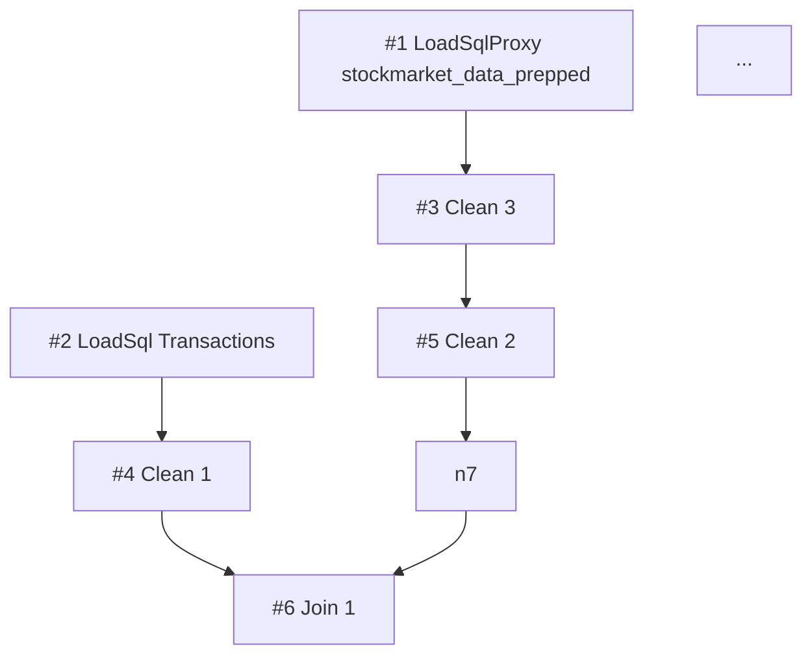

# flow-summary-format

**`prep-extractor` Skill** の出力（`flow-summary.md`）の書式仕様。本 Skill が flow.json を読んでこの形式に変換する。後段 (`prep-architect` の analyze/decompose/build) は **flow.json を直接読まず、`flow-summary.md` のみ** を参照する。

## 目次

- トップレベル構造
- 各セクションの書式 (Meta / Topology / Dependency DAG / SuperTransform actions inventory / Warnings)
- 出力先 / 後続フェーズへの引き継ぎ / 実装上の指針 / 参考

## トップレベル構造

必須セクション（順序固定）：

```markdown
# Flow summary: <flow-name>

## Meta
## Topology
## Dependency DAG (Mermaid)
## SuperTransform actions inventory
## Warnings
```

## 各セクションの書式

### Meta

```markdown
## Meta
- Source: `work/<date>_<summary>/flow.json`
- Flow name: <flow name>
- Total nodes: 29
- Total actions (across SuperTransforms): 91
- Distinct nodeTypes: LoadSqlProxy(1), LoadSql(1), SuperTransform(18), SuperJoin(3), SuperUnion(2), SuperAggregate(1), SuperNewRows(1), PublishExtract(2)
- Outputs: 2 (`stockmarket_transaction_prepped`, `stockmarket_transaction_detailed_prepped`)
- Incremental inputs: Stock and Index Price (control field: Date)
- Append-mode outputs: Output
- Generated at: <ISO-date>
```

`Outputs:` 行は [publish_manifest.py](../../../../scripts/publish_manifest.py) の legacy `init` 経路がこの行形をパースする機械可読行 (書式を変えない。PublishExtract が無いフローでは省略される)。`Incremental inputs` / `Append-mode outputs` の 2 行は **該当がある場合のみ** 出力される。ソースは `flow["nodeProperties"]` の `IncrementalConfiguration` (incrementalEnabled=true の Input と control field caption) と `OutputRefreshOptions` (outputOperationType が Append の Output)。nodes の walk では見えない場所にあるため、この行の有無が incremental フロー検出の一次シグナルになる。

### Topology

ノード一覧を **トポロジカル順** で表に並べる。短 ID は `initialNodes` からの BFS で採番。`Prev` は `nextNodes` から逆引きして埋める。

```markdown
## Topology

| # | UUID (short) | nodeType | Name | Prev | Next | Actions |
|---|---|---|---|---|---|---|
| 1 | a4b3c2... | LoadSqlProxy | stockmarket_data_prepped | — | 3 | — |
| 2 | f1e2d3... | LoadSql | Transactions | — | 4 | — |
| 3 | 1234ab... | SuperTransform | Clean 3 | 1 | 5 | RemoveColumns×6 |
| 4 | 5678cd... | SuperTransform | Clean 1 | 2 | 6 | Rename×4, AddColumn×1 |
| 5 | ... | SuperTransform | Clean 2 | 3 | 7 | ChangeColumnType×1, AddColumn×1, FilterOperation×1, RemoveColumns×1, Rename×2 |
| 6 | ... | SuperJoin | Join 1 | 4, 7 | 8 | — |
| ... |
```

- `#`: 短 ID（BFS 順、`#1` から連番）
- `UUID (short)`: 元 UUID の先頭 6 文字程度（debugging 用、フル UUID は不要）
- `nodeType`: バージョンプレフィクス除去後（`SuperTransform` 等）
- `Name`: Prep UI 表示名
- `Prev`: 逆引きした前段ノードの短 ID（複数なら `,` 区切り）
- `Next`: `nextNodes[].nextNodeId` を短 ID に変換（複数なら `,` 区切り）
- `Actions`: 操作を持つステップ（flat SuperTransform / Container / Input renames）は type 別カウントをカンマ区切り。Input 由来は末尾に `(input)` を付す。操作を持たないノードは `—`

### Dependency DAG (Mermaid)

```markdown
## Dependency DAG



- ノードラベル: `#<short-id> <nodeType> <Name>`
- 矢印は `Prev → 自ノード` ではなく `nextNodes` から作る（元 JSON のソース・オブ・トゥルース）
- **分岐（1 → 多）** と **合流（多 → 1）** が一目で分かるレイアウト

### SuperTransform actions inventory

各ステップの操作列を 1 行サマリ化（`scripts/inspect_actions.py` 出力と同形式）。セクション名は互換のため固定だが、**3 つの操作保持形式すべて**を収録する（詳細は [tfl-json-schema.md §Clean ステップの 2 つのシリアライズ形式](../../../../references/tfl-json-schema.md#clean-ステップの-2-つのシリアライズ形式)）:

- **flat SuperTransform**: `beforeActionAnnotations` — 見出しにタグなし
- **Container**（`.v1.Container` の Clean ステップ）: `loomContainer` 子ノード — 見出しに ` [container 形式]`
- **Input renames**: Input ノードの `actions`（難読化 UUID → 表示名の RenameColumn 等）— 見出しに ` [Input renames]`

見出し例（形式タグ付き）:

```markdown
### #2: Transactions (13 actions) [Input renames]
### #4: Clean 1 (2 actions) [container 形式]
```

Meta の `Total actions` 行にも形式別内訳が付く（例: `19 (Container: 6, Input renames: 13)`）。

```markdown
## SuperTransform actions inventory

### #3: Clean 3 (6 actions)

1. **RemoveColumns**: `Open`
2. **RemoveColumns**: `High`
3. **RemoveColumns**: `Low`
4. **RemoveColumns**: `Volume`
5. **RemoveColumns**: `Category`
6. **RemoveColumns**: `JP Flag`

### #4: Clean 1 (5 actions)

1. **Rename**: `単価 (Usd)` → `単価 (USD)`
2. **Rename**: `手数料 (Usd)` → `手数料 (USD)`
3. **Rename**: `税金 (Usd)` → `税金 (USD)`
4. **Rename**: `Usd/Jpy` → `USDJPY`
5. **AddColumn**: `row_num` = `{{ PARTITION [銘柄]: { ORDERBY [約定日] ASC: ROW_NUMBER() } }}`

[各 SuperTransform 続く]

### #11: Clean 13 (0 actions)

_(no actions — empty Clean step)_
```

actions 種別ごとのフォーマット:

| action type | フォーマット |
|---|---|
| `RenameColumn` | `**Rename**: \`<old>\` → \`<new>\`` |
| `ChangeColumnType` | `**ChangeColumnType**: \`<column>\` → \`<newType>\`` |
| `AddColumn` | `**AddColumn**: \`<column>\` = \`<expression-one-liner>\`` （200 字超は省略） |
| `RemoveColumns` | `**RemoveColumns**: \`<col1>\`, \`<col2>\`, ...` |
| `ValueFilter` / `FilterOperation` | `**<type>**: column=\`<col>\` expr=\`<expr>\`` |
| 未知の type | `**<type>**: <raw JSON 抜粋>` |

### Warnings

```markdown
## Warnings

- ⚠️ Unknown nodeType: `MyCustomNode` at node #14（レイヤ推定保留、build 時は転写のみ）
- ⚠️ Unknown action type: `SplitColumn` at node #7 action 2（raw JSON で残す）
- 💡 Empty SuperTransform: #11 (Clean 13) has 0 actions — 削除候補（decompose で判断）
- 💡 Duplicate name: `Clean 14` appears at #13 and #16（build 時にファイル名を区別）
- 🔒 Node #10 Union 3 (SuperUnion): injects implicit `Table Names` column — do NOT propose deletion
- 🔒 Node #18 Union 1 (SuperUnion): injects implicit `Table Names` column — do NOT propose deletion
```

警告の種類:
- ⚠️ **Unknown nodeType / action type**: 未対応の種別を発見
- ⚠️ **Container not convertible**: `.v1.Container` が flat SuperTransform に損失なく変換できない（マルチ namespace / 分岐 / ネスト）。build 時は verbatim 転写のみで actions 分割不可
- ⚠️ **Backward edge / cycle suspected**: トポロジ復元中に循環依存の兆候
- 💡 **Empty SuperTransform / Empty Container**: actions=0 のノード（削除候補）
- 💡 **Duplicate name**: 同名ノードが複数存在
- 💡 **Disconnected node**: どこにも繋がっていないノード
- 🔒 **SuperUnion node**: **全件必ず 1 行ずつ機械的に追加**。Union ノードは `Table Names` 列を暗黙注入する → 後段の architect が削除候補にする事故を防ぐ
- 🔒 **Incremental/append flow**: incremental input または append 出力を検出した場合に 1 行追加。append 出力の PDS は過去 run の累積なので**全体行数 parity は成立しない** → architect は継承方針を設計 (decompose-self-check 項目 16)、comparator は control field による期間一致比較に切り替える

## 出力先

Skill 起動時にユーザー（または上位 Skill）から absolute path で指定される。典型的には:

```
work/<yyyymmdd>_<summary>/reports/flow-summary.md
```

## 後続フェーズへの引き継ぎ

analyze / decompose / build は **以下のセクションだけ** 読めば十分:

| セクション | 利用フェーズ |
|---|---|
| Meta | analyze（メタ情報）|
| Topology | analyze, decompose（依存関係・レイヤ推定の基礎）|
| Dependency DAG | decompose（逆参照検知、分割境界の可視化）|
| SuperTransform actions inventory | analyze（レイヤ推定の actions レベル材料）, decompose（actions レベル分割）, build（actions の振り分け） |
| Warnings | 全フェーズ（リスク事前把握）|

⚠️ **後続フェーズが flow.json を直接読むのは禁止**（build フェーズの .tfl 再構築時のみ例外）。理由: コンテキスト肥大の防止と「extract の summary が真実」という運用規律。

## 実装上の指針

本書式は [../scripts/gen_flow_summary.py](../scripts/gen_flow_summary.py) が実装しており、Phase A はこのスクリプトを実行して 5 セクションを一括生成する（手組みしない）。詳細手順は [flow-extraction-procedure.md](flow-extraction-procedure.md) を参照。書式を変更する場合は本ファイルとスクリプトを同時に更新する。

## 参考

- .tfl スキーマ・依存関係の罠: [../../../../references/tfl-json-schema.md](../../../../references/tfl-json-schema.md)
- UI ⇔ nodeType / actions 対応: [../../../../references/tfl-json-schema.md §UI ステップ ⇔ nodeType マッピング](../../../../references/tfl-json-schema.md#ui-ステップ--nodetype-マッピング)
- actions 抽出補助スクリプト: [../scripts/inspect_actions.py](../scripts/inspect_actions.py)
