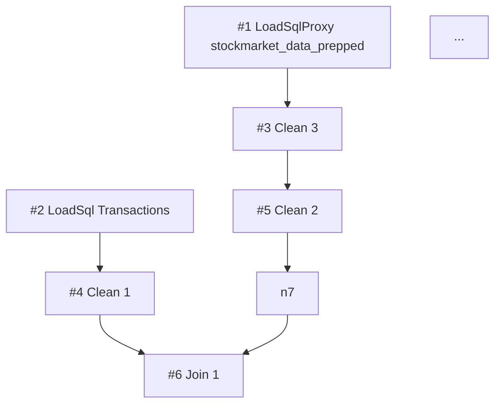

# flow-summary-format

**`prep-extractor` Skill** の出力（`flow-summary.md`）の書式仕様。本 Skill が flow.json を読んでこの形式に変換する。後段 (`prep-architect` の analyze/decompose/build) は **flow.json を直接読まず、`flow-summary.md` のみ** を参照する。

`prep-extractor` は `context: fork` で動くため、flow.json 読み込みのコンテキスト肥大は主会話に波及しない。

## 設計意図

- **コンパクト化**: 数百ノードのフローでも数 KB 程度の markdown に収まること
- **構造保全**: トポロジ・依存・actions の情報を機械的に取り出せる形式
- **可視化**: Mermaid DAG により逆参照や分岐構造を一目で確認できる
- **未知種別のフォールバック**: 不明な nodeType / action 種別が出てもエラーにせず、警告として残す

## トップレベル構造

必須セクション（順序固定）：

```markdown
# Flow summary: <flow-name>

## Meta
## Topology
## Dependency DAG (Mermaid)
## SuperTransform actions inventory
## Warnings
```

## 各セクションの書式

### Meta

```markdown
## Meta
- Source: `work/<date>_<summary>/flow.json`
- Flow name: <flow name>
- Total nodes: 29
- Total actions (across SuperTransforms): 91
- Distinct nodeTypes: LoadSqlProxy(1), LoadSql(1), SuperTransform(18), SuperJoin(3), SuperUnion(2), SuperAggregate(1), SuperNewRows(1), PublishExtract(2)
- Generated at: <ISO-date>
```

### Topology

ノード一覧を **トポロジカル順** で表に並べる。短 ID は `initialNodes` からの BFS で採番。`Prev` は `nextNodes` から逆引きして埋める。

```markdown
## Topology

| # | UUID (short) | nodeType | Name | Prev | Next | Actions |
|---|---|---|---|---|---|---|
| 1 | a4b3c2... | LoadSqlProxy | stockmarket_data_prepped | — | 3 | — |
| 2 | f1e2d3... | LoadSql | Transactions | — | 4 | — |
| 3 | 1234ab... | SuperTransform | Clean 3 | 1 | 5 | RemoveColumns×6 |
| 4 | 5678cd... | SuperTransform | Clean 1 | 2 | 6 | Rename×4, AddColumn×1 |
| 5 | ... | SuperTransform | Clean 2 | 3 | 7 | ChangeColumnType×1, AddColumn×1, FilterOperation×1, RemoveColumns×1, Rename×2 |
| 6 | ... | SuperJoin | Join 1 | 4, 7 | 8 | — |
| ... |
```

- `#`: 短 ID（BFS 順、`#1` から連番）
- `UUID (short)`: 元 UUID の先頭 6 文字程度（debugging 用、フル UUID は不要）
- `nodeType`: バージョンプレフィクス除去後（`SuperTransform` 等）
- `Name`: Prep UI 表示名
- `Prev`: 逆引きした前段ノードの短 ID（複数なら `,` 区切り）
- `Next`: `nextNodes[].nextNodeId` を短 ID に変換（複数なら `,` 区切り）
- `Actions`: SuperTransform の場合、`beforeActionAnnotations` を type 別にカウントしてカンマ区切り。SuperTransform 以外は `—`

### Dependency DAG (Mermaid)

```markdown
## Dependency DAG



- ノードラベル: `#<short-id> <nodeType> <Name>`
- 矢印は `Prev → 自ノード` ではなく `nextNodes` から作る（元 JSON のソース・オブ・トゥルース）
- **分岐（1 → 多）** と **合流（多 → 1）** が一目で分かるレイアウト

### SuperTransform actions inventory

各 SuperTransform の `beforeActionAnnotations` を 1 行サマリ化（`scripts/inspect_actions.py` 出力と同形式）：

```markdown
## SuperTransform actions inventory

### #3: Clean 3 (6 actions)

1. **RemoveColumns**: `Open`
2. **RemoveColumns**: `High`
3. **RemoveColumns**: `Low`
4. **RemoveColumns**: `Volume`
5. **RemoveColumns**: `Category`
6. **RemoveColumns**: `JP Flag`

### #4: Clean 1 (5 actions)

1. **Rename**: `単価 (Usd)` → `単価 (USD)`
2. **Rename**: `手数料 (Usd)` → `手数料 (USD)`
3. **Rename**: `税金 (Usd)` → `税金 (USD)`
4. **Rename**: `Usd/Jpy` → `USDJPY`
5. **AddColumn**: `row_num` = `{{ PARTITION [銘柄]: { ORDERBY [約定日] ASC: ROW_NUMBER() } }}`

[各 SuperTransform 続く]

### #11: Clean 13 (0 actions)

_(no actions — empty Clean step)_
```

actions 種別ごとのフォーマット:

| action type | フォーマット |
|---|---|
| `RenameColumn` | `**Rename**: \`<old>\` → \`<new>\`` |
| `ChangeColumnType` | `**ChangeColumnType**: \`<column>\` → \`<newType>\`` |
| `AddColumn` | `**AddColumn**: \`<column>\` = \`<expression-one-liner>\`` （200 字超は省略） |
| `RemoveColumns` | `**RemoveColumns**: \`<col1>\`, \`<col2>\`, ...` |
| `ValueFilter` / `FilterOperation` | `**<type>**: column=\`<col>\` expr=\`<expr>\`` |
| 未知の type | `**<type>**: <raw JSON 抜粋>` |

### Warnings

```markdown
## Warnings

- ⚠️ Unknown nodeType: `MyCustomNode` at node #14（レイヤ推定保留、build 時は転写のみ）
- ⚠️ Unknown action type: `SplitColumn` at node #7 action 2（raw JSON で残す）
- 💡 Empty SuperTransform: #11 (Clean 13) has 0 actions — 削除候補（decompose で判断）
- 💡 Duplicate name: `Clean 14` appears at #13 and #16（build 時にファイル名を区別）
- 🔒 Node #10 Union 3 (SuperUnion): injects implicit `Table Names` column — do NOT propose deletion
- 🔒 Node #18 Union 1 (SuperUnion): injects implicit `Table Names` column — do NOT propose deletion
```

警告の種類:
- ⚠️ **Unknown nodeType / action type**: 未対応の種別を発見
- ⚠️ **Backward edge / cycle suspected**: トポロジ復元中に循環依存の兆候
- 💡 **Empty SuperTransform**: actions=0 のノード（削除候補）
- 💡 **Duplicate name**: 同名ノードが複数存在
- 💡 **Disconnected node**: どこにも繋がっていないノード
- 🔒 **SuperUnion node**: **全件必ず 1 行ずつ機械的に追加**。Union ノードは `Table Names` 列を暗黙注入する → 後段の architect が削除候補にする事故を防ぐ

## 出力先

Skill 起動時にユーザー（または上位 Skill）から absolute path で指定される。典型的には:

```
work/<yyyymmdd>_<summary>/reports/flow-summary.md
```

## 後続フェーズへの引き継ぎ

analyze / decompose / build は **以下のセクションだけ** 読めば十分:

| セクション | 利用フェーズ |
|---|---|
| Meta | analyze（メタ情報）|
| Topology | analyze, decompose（依存関係・レイヤ推定の基礎）|
| Dependency DAG | decompose（逆参照検知、分割境界の可視化）|
| SuperTransform actions inventory | analyze（レイヤ推定の actions レベル材料）, decompose（actions レベル分割）, build（actions の振り分け） |
| Warnings | 全フェーズ（リスク事前把握）|

⚠️ **後続フェーズが flow.json を直接読むのは禁止**（build フェーズの .tfl 再構築時のみ例外）。理由: コンテキスト肥大の防止と「extract の summary が真実」という運用規律。

## 実装上の指針

詳細手順は本 Skill の [SKILL.md](../SKILL.md) を参照。要点:

1. ユーザーから `.tfl` / `.tflx` / 既に展開済の `flow.json` のパスを受け取る
2. `.tfl` / `.tflx` の場合は `zipfile` で unzip して `flow.json` を取り出す（Bash 経由）
3. 構造リファレンス（tfl-json-schema.md / prep-ui-to-json-mapping.md）を Read
4. flow.json をパースし、本書式に従って `flow-summary.md` を生成
5. 元の flow.json は参考のため `work/<date>/flow.json` に残しておく（git 追跡外）

## 参考

- .tfl スキーマ・依存関係の罠: [../../../../references/tfl-json-schema.md](../../../../references/tfl-json-schema.md)
- UI ⇔ nodeType / actions 対応: [../../../../references/prep-ui-to-json-mapping.md](../../../../references/prep-ui-to-json-mapping.md)
- actions 抽出補助スクリプト: [../scripts/inspect_actions.py](../scripts/inspect_actions.py)
