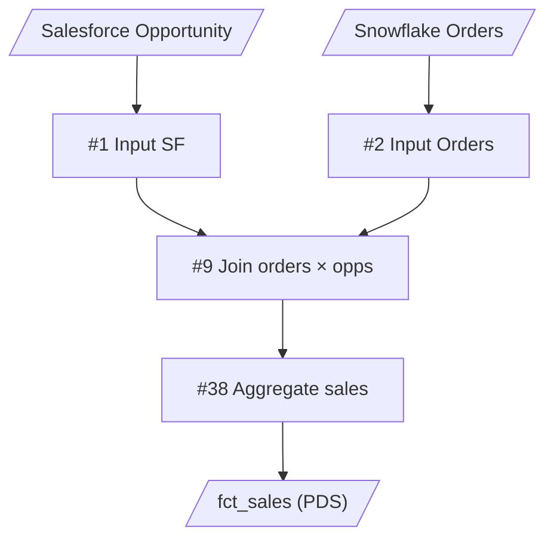
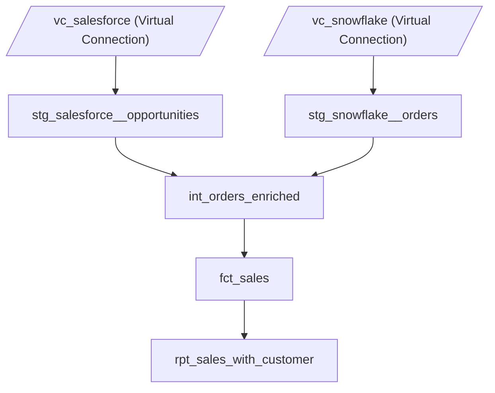

# decomposition-plan-format

**decompose フェーズ**の出力——分解設計案レビュービューの書式を定義する。

**md も HTML も手書きしない**: 設計の正は `decomposition-plan-<flow>.json` ([plan-json-schema.md](plan-json-schema.md)) で、tableau-prep-architect の `render_plan_md.py` が同一の検証パスから 2 つのビューをレンダリングする:

| ビュー | 役割 |
|---|---|
| `decomposition-plan-<flow>.md` | git 追跡の設計記録 + ターミナル fallback。本ファイルの §各セクションの書式 が仕様 |
| `decomposition-plan-<flow>.html` | **Stop 2 の主レビュー面** (ユーザーがブラウザで開く)。自己完結・静的 (JS なし・外部参照なし)。構成は [§HTML ビューの構成](#html-ビューの構成) |

build (`tableau-prep-builder`) と manifest init は plan.json を直接消費する。本ファイルの各セクション書式はレンダラの出力仕様であると同時に、**セクションが担う設計判断の意味論** (Input policy / Rename-back / Lineage closure) の正典でもある — architect は plan.json を書くときこの意味論に従う。

目次:

- [トップレベル構造](#トップレベル構造)
- [Verbosity policy (出力量最小化)](#verbosity-policy-出力量最小化)
- [各セクションの書式](#各セクションの書式) — Summary / New .tfl files / Input dispatch と stg materialization / Input provisioning required / Joins / Lineage closure invariant / Actions-level splits / Output mapping / Rename-back / Target project layout / Dependency DAG / Migration order / Alternatives considered
- [HTML ビューの構成](#html-ビューの構成)
- [ファイル名と出力先](#ファイル名と出力先)
- [tableau-prep-builder / tableau-prep-deployer への引き継ぎ](#tableau-prep-builder--tableau-prep-deployer-への引き継ぎ)

## トップレベル構造

セクション（順序固定）。**必須** と **optional** で区別する:

```markdown
# Decomposition Plan: <flow-name>

## Summary                                          # 必須
## New .tfl files                                   # 必須
## Actions-level splits                             # 必須 (該当ノードあれば本文、無ければ "なし" の 1 行)
## Output mapping (original → decomposed)           # 必須
## Target Tableau Cloud project layout              # 必須
## Dependency DAG (Mermaid)                         # 必須
## Migration order                                  # 必須 (簡潔な箇条書き)
## Input provisioning required                      # optional (direct_db / extract が 1 件以上ある場合のみ)
## Alternatives considered                          # optional (非自明な判断分岐があった時のみ)
```

## Verbosity policy (出力量最小化)

md の定型部はレンダラが生成するため、**architect の output token は plan.json の設計フィールドに限られる**。そこでも冗長さを避ける:

- **description**: 各 entry で **1-2 行に圧縮**。業務的な詳細解説は `analysis-*.md` 側に既にある (重複しない)
- **alternatives**: 非自明な判断分岐 (例: 1 entity 1 .tfl ルールを破る判断、独自命名規約を採用する判断) があったときのみ書く。自明な決定では **省略可** (テンプレで 3 案検討するのは不要)
- Upstream lineage 表・Migration order・DAG はレンダラが plan.json から機械生成する (architect は書かない)

各セクションが参照する判断基準:

- `Actions-level splits` — [../.claude/skills/tableau-prep-architect/references/intermediate-decomposition.md](../.claude/skills/tableau-prep-architect/references/intermediate-decomposition.md)（1 SuperTransform を複数 .tfl に分けるケース）
- `Target Tableau Cloud project layout` — [project-hierarchy.md](project-hierarchy.md)
- Input 整理 — [input-policy.md](input-policy.md)

## 各セクションの書式

### Summary

```markdown
## Summary

- 元フロー: source.tflx（47 ステップ）
- 新規 .tfl: 8 個
  - stg: 3 個（salesforce__opportunities, snowflake__orders, snowflake__customers）
  - int: 2 個（entity 別: orders, customer — 各 1 .tfl にまとめる）
  - marts: 3 個（fct 1 + dim 1 + rpt 1）
- publish 粒度: **全層 (stg/int/marts) を Published DS として publish**。下流レイヤは上流レイヤの PDS を Input として参照 (Cloud では flow 間 chain は PDS 経由が前提、Hyper file 出力は cross-flow 共有不可)
```

### New .tfl files

各新 .tfl ごとに 1 セクション。レイヤ順（stg → int → mart）に並べる。

各 entry のフィールド仕様（キーの必須条件）:

- **Layer** (必須): staging / intermediate / marts
- **Materialization** (stg のみ): `live_pds` / `tfl`。要件差は [§Input dispatch と stg materialization](#input-dispatch-と-stg-materialization)
- **Inputs** (必須): source (vconn / DB 等) または上流 Published DS。passthrough の元 PDS は Project path + LUID を併記
- **Outputs** (必須): Type / Name / Target project の 3 行
- **Included original steps** + **Upstream lineage** 表: `live_pds` 以外で必須 ([§Lineage closure invariant](#lineage-closure-invariant-なぜ-upstream-lineage-が必須か)) / **Transforms (column-level)** 表: `live_pds` のみ
- **Joins**: Join を含む .tfl のみ ([§Joins field の書式](#joins-field-の書式))
- **Rename-back** 表: Output mapping に行を持つ mart のみ ([§Rename-back](#rename-back-mart-境界の-presentation-rename))
- **Description** (必須): 1-2 行 ([§Verbosity policy](#verbosity-policy-出力量最小化))

代表 2 例（live_pds な stg / 通常 .tfl の int）のみフルで示す:

```markdown
## New .tfl files

### stg_salesforce__opportunities

- **Layer**: staging
- **Materialization**: `live_pds` (input が仮想接続のため [tableau-pds-augmenter](../.claude/skills/tableau-pds-augmenter/SKILL.md) で publish。要件は [§Input dispatch と stg materialization](#input-dispatch-と-stg-materialization))
- **Inputs**:
  - Source: `vc_salesforce` (仮想接続) / `Opportunity` テーブル
- **Outputs**:
  - Type: Published Data Source
  - Name: `stg_salesforce__opportunities`
  - Target project: `Sales Analytics/datasources/stg` (PDS publish 先。flow と PDS が別プロジェクトになるレイアウトは [project-hierarchy.md](project-hierarchy.md))
- **Transforms (column-level)**:
  | op | column_name | to_caption | to_datatype |
  |---|---|---|---|
  | rename | `[bbbbbbbb-0000-0000-0000-000000000001]` | `商談ID` | — |
  | rename | `[cccccccc-0000-0000-0000-000000000002]` | `単価 (USD)` | — |
  | cast | `[dddddddd-0000-0000-0000-000000000003]` | `金額` | `real` |
  | hide | `[eeeeeeee-0000-0000-0000-000000000004]` | — | — |
- **Description**:
  Opportunity テーブルの UUID 列名を元の内部名にピン留め (`単価 (USD)` は actions-split で吸収した正規化)。semantic translation はしない。

### stg_snowflake__orders

[同じ書式で続く。Materialization=`tfl` の stg は Transforms 表の代わりに **Included original steps** + **Upstream lineage** 表を書く]

### int_orders_enriched

- **Layer**: intermediate
- **Inputs**:
  - Published DS: `stg_snowflake__orders` (decompose 生成済 stg PDS)
  - Published DS: `stg_salesforce__opportunities` (decompose 生成済 stg PDS)
  - Published DS: `stockmarket_data_prepped` (**passthrough from source flow** — stg を作らず元 PDS を直接参照)
    - Project path: `0_Datasource`
    - LUID: `aaaaaaaa-0000-0000-0000-000000000001`
- **Outputs**:
  - Type: Published Data Source
  - Name: `int_orders_enriched`
  - Target project: `Sales Analytics/datasources/intermediate`
- **Joins**:
  - #9 SuperJoin orders × opps: cardinality `N:1` (各 order に対し対応する opp は 1 件)
- **Included original steps**: 9, 10, 11, 12, 13, 14, 15, 16, 17, 18, 19, 20
- **Upstream lineage** (REQUIRED):
  | Included step | Reachable from Input(s) | Source Prev chain |
  |---|---|---|
  | #9 SuperJoin orders×opps | `stg_snowflake__orders`, `stg_salesforce__opportunities` | (#5 + #6) → #9 |
  | #10 SuperTransform Filter | `stg_snowflake__orders`, `stg_salesforce__opportunities` | #9 → #10 |
  | ... | ... | ... |
- **Description**:
  orders entity に関する intermediate 処理を 1 .tfl にまとめる（[intermediate-decomposition.md](../.claude/skills/tableau-prep-architect/references/intermediate-decomposition.md) の原則）: フィルタ（status='active', テストデータ除外）→ Salesforce Opportunity との JOIN → 売上区分・優良顧客フラグ等のビジネスロジック計算。

### int_customer_classified

[同じ書式で続く]

(以下、同じ書式で fct_sales / dim_customer / rpt_sales_with_customer のエントリが続く。fct_sales は Output mapping に行を持つため **Rename-back** 表を持ち、rpt_sales_with_customer は Published DS 同士の LEFT JOIN を含むため **Joins** フィールドを持つ)
```

### Input dispatch と stg materialization

stg レイヤの各 entry の取扱は、tableau-prep-extractor Phase B の **`input-dispatch-mech.json`** (mechanical findings) を architect が読んで決定する。Input 単位の policy は以下の 4 値:

| kind + 状態 | policy | stg entry を plan に置くか | 後段の挙動 |
|---|---|---|---|
| `pds` + `resolution.status=resolved` | `passthrough` | **置かない** | int 等の下流 entry が `Inputs` で **元 PDS を直接参照** (LoadSqlProxy で project_path + name + LUID) |
| `vconn` | `augment` | 置く + `Materialization: live_pds` | [tableau-prep-builder](../.claude/skills/tableau-prep-builder/SKILL.md) が .tfl を作らず、`flows/staging/<name>.augmenter.json` (tableau-pds-augmenter spec) を emit。[tableau-prep-deployer](../.claude/skills/tableau-prep-deployer/SKILL.md) は `augment_pds.py` を呼んで publish (run フェーズは skip) |
| `pds` + `ambiguous` / `unresolved`、または PDS だが整形要 (架空ドメインの匂い) | `augment` (Stop 2 でユーザー確定) | 置く + `Materialization: live_pds` | 同上 |
| 非標準 stg (将来的に non-vconn な複雑 stg が必要な場合) | `tfl` | 置く + `Materialization: tfl` | 従来通り .tfl を組み立てて publish + run |
| `direct_db` / `extract` | `needs_provisioning` | 置く + `input_status: needs_provisioning` | build 時に当該 stg を skip + manifest warning、`## Input provisioning required` セクションに整備案を 1 件記載 |

**判定の責任分担**:

- **tableau-prep-extractor (Phase B)** は kind 分類と LUID 解決のみ。policy 判定は持たない (mechanical only)
- **architect** が `input-dispatch-mech.json` を読み、上表の policy を当て、Stop 2 でユーザー確認を取る ([../.claude/skills/tableau-prep-architect/references/review-checkpoints.md](../.claude/skills/tableau-prep-architect/references/review-checkpoints.md) の Tier 1)
- **builder が再検証**: `Materialization=live_pds` 宣言があっても `inspect_input_node()` が `vconn` を返さなければ build 中断 + escalation (silent fallback 禁止)。passthrough の int Inputs に書かれた PDS LUID も build 時に flow_io 経由で実在確認

**Materialization=live_pds** のときの追加要件:

- `Inputs` セクションに **vconn の display name と table name** を 1 行で明記 (例: `Source: Google Drive Tables (仮想接続) / Transactions`)。vconn LUID / table UUID は builder が flow.json から自動取得するので plan には書かなくて良い
- `Transforms (column-level)` セクションを置く。`op` ∈ `{rename, cast, hide}`、`column_name` は `[<uuid>]` 形式 (元 Input ノードの `fields[].name` を bracket で囲んだもの)。op=rename/cast には `to_caption` 必須、cast には `to_datatype` 必須、hide は両方 `—`
- **`to_caption` は元の内部名へのピン留めに限る** ([input-policy.md §命名レジーム](input-policy.md) が正典): 原則 = 現行 caption をそのまま (skeleton の初期値が正解)、例外 = actions-split で stg に吸収した正規化 rename (例: `単価 (Usd)` → `単価 (USD)`) の反映のみ。**英語等への semantic translation は禁止** — 下流の転写式が元名で列参照するため run が fail する
- `Included original steps` と `Upstream lineage` は **省略可** (Transforms 表で element 単位を表現するため)
- `Description` は引き続き必須

**Materialization=tfl** のとき:

- 既存通り `Included original steps` + `Upstream lineage` 必須、`Transforms (column-level)` は書かない

**入力 row-level 操作の混入チェック**: `Materialization=live_pds` の Transforms 表に `rename` / `cast` / `hide` 以外の op が混じっていたら augmenter で表現不可なので、当該 actions を `Actions-level splits` セクションで int 側に分割し直す (詳細は [../.claude/skills/tableau-prep-architect/references/decompose-self-check.md](../.claude/skills/tableau-prep-architect/references/decompose-self-check.md) の項目 13)。

### Input provisioning required (needs_provisioning が 1 件以上ある場合)

`direct_db` / `extract` Input がある場合のみ本セクションを置く。build 時に当該 stg は skip されるため、Cloud 側で整備が必要な作業を 1 件 1 行で列挙する。

```markdown
## Input provisioning required

| Input # | Source | kind | 推奨整備 | 整備後の再開手順 |
|---|---|---|---|---|
| 3 | Snowflake PUBLIC.ORDERS | direct_db (snowflake) | 仮想接続 `vc_snowflake_orders` を作成し、Prep flow の Input を差し替えて再 extract | Phase A から再開 (flow 自体が変わるため) |
| 4 | ./local/customers.hyper | extract | Tableau Desktop で `customers.hyper` を `.tdsx` 化し Tableau Cloud に PDS publish。Prep flow の Input を PDS 参照に差し替え | 同上 |
```

build 進行判断: ユーザーが Stop 2 で `OK` を返した場合、tableau-prep-builder は needs_provisioning stg を skip して進行 (partial build)。下流 int / marts は当該 stg PDS 不在で run 時に fail するが、これは正常な escalation 経路 ([../.claude/skills/tableau-prep-deployer/references/autonomous-recovery.md](../.claude/skills/tableau-prep-deployer/references/autonomous-recovery.md))。`OK` 前に整備するならユーザーが Cloud 整備 → flow 差し替え → Phase A から再開する。

### Joins field の書式

`**Joins**` フィールドは **SuperJoin ノード、または .tfl 内で Join を行うステップを含む .tfl のみ** で必須 (Hyper Input 同士の Join、Published DS 同士の Join どちらも対象)。SuperUnion は row 連結のため cardinality 概念が適用外で、本フィールドの対象外。

書式:

- 1 行 1 Join。`#<step-index> <ノード名>: cardinality \`<N:M>\` (補足)` または `<JOIN-type> <left> × <right> on <key>: cardinality \`<N:M>\` (補足)`
- cardinality は `1:1` / `1:N` / `N:1` / `N:N` / `不明` のいずれか
- **不明な場合も明示的に `不明` と書く** (空欄不可、書き忘れ防止)
- カッコ書きで自然言語の補足を入れて良い (例: `1:N (1 opportunity → 複数 orders)`)
- 該当 Join が無い .tfl では本フィールドを省略する

### Lineage closure invariant (なぜ Upstream lineage が必須か)

`Included original steps` に書いた各ステップは、**元 flow の Prev 連鎖を辿ったときに、その新 .tfl が宣言した Inputs のいずれかに到達する必要がある**。

**下流の結合キー (`[ID]` 等) から逆推定して配置先 .tfl を決めると、その列が上流 Input に存在しないケースで run 時に `Unknown field name` で失敗する**。配置先は必ず上流から判定する。

判定の正しい順序:

1. flow-summary.md の Topology 表で **そのステップの Prev** を確認
2. Prev を辿って **元の Input ノードを特定**
3. その Input が新 .tfl の Inputs に含まれているか確認
4. 含まれていなければ **そのステップは別の .tfl に配置** すべき

`Upstream lineage` 表を埋める作業がこの 3 ステップを強制する。書かなくて済むと逆推定で済まされて事故る。

tableau-prep-builder の build 開始前に [`scripts/flow_io.py`](../scripts/flow_io.py) の `verify_lineage_closure` が同じ不変条件を機械的にチェックする (二重防御)。

### Actions-level splits

1 つの SuperTransform ノードが **複数レイヤに跨る actions** を持つ場合、その actions を分割して別々の .tfl に振り分ける必要がある。例: 「Clean 1」が `Rename×4`（stg 相当の単純整形）と `ROW_NUMBER LOD`（int 相当の Window 計算）を 1 ノードに同梱しているケース。判断基準は [intermediate-decomposition.md](../.claude/skills/tableau-prep-architect/references/intermediate-decomposition.md) 参照。

判定の元データは [analysis-report-format.md](../.claude/skills/tableau-prep-architect/references/analysis-report-format.md) — actions inventory（tableau-prep-extractor の `inspect_actions.py` 出力 / `flow-summary.md` の SuperTransform actions inventory セクション）を参照。

```markdown
## Actions-level splits

| 元ノード | 元 actions 内訳 | 分割案 | 備考 |
|---|---|---|---|
| Clean 1 (#4) | Rename×4 (USD 表記統一) + AddCol×1 (ROW_NUMBER LOD) | stg__transactions.tfl: Rename×4 のみ／int 側で改めて ROW_NUMBER を生成 | 単純整形と Window 計算の混在 |
| Clean 2 (#5) | ChangeType + FIXED MAX + Filter + Rename×2 | stg: ChangeType のみ／int: FIXED MAX + Filter + Rename×2 | 型キャストと業務集約の混在 |
| Clean 15 (#23) | RemoveCol×2 + PATH 最終調整 (PARTITION ROW_NUMBER) | int: PATH 再採番／mart 側で必要なら RemoveCol 追加 | Window と最終整形の混在 |

### 分割の原則

- **依存関係を保つ**: 後段 actions が前段 actions の出力列を参照する場合、順序を勝手に並び替えない (実装は tableau-prep-builder に委ねる)
- **新規 .tfl の数は最小化**: 「actions を 1 つずつ別 .tfl」のような過剰分割はしない。レイヤ境界で切るのが原則
- **意味のかたまりを優先**: 業務ロジック的に 1 つの「列追加群」（例: Clean 6 の AddCol×9 = 損益計算）は 1 .tfl 内に保つ
- **削除候補ノードも明示**: actions=0 の空ノード（例: Clean 13）は分割対象ではなく削除対象
```

### Output mapping (original → decomposed)

機械可読の名前対応表。元フローの output PDS と、それを引き継ぐ分解後 flow の output PDS を 1 行 1 ペアで列挙する。**元フローの output と対応関係のある分解後 flow のみ** 行を持つ (通常は marts レイヤ、ただし元フローが intermediate 相当の PDS を直接出力していた場合はその対応も記載)。**元フローに対応 output が無い分解後 flow (新規生成された stg/int の中間 PDS 等)** は本表に出さず、publish-manifest 上で `source_original_output_name = null` として登録される。1 元 PDS → 複数 marts への fan-out があれば複数行で表現する。

```markdown
## Output mapping (original → decomposed)

| Original output PDS | Decomposed flow | Decomposed output PDS |
|---|---|---|
| stockmarket_transaction_prepped | fct_transactions_summary | fct_transactions_summary |
| stockmarket_transaction_detailed_prepped | fct_transactions_matched | fct_transactions_matched |
```

列の意味:

- `Original output PDS`: 元フローの PublishExtract Output ノードが書き出している PDS 名 (flow-summary.md `Meta` の `Outputs:` リストと一致)
- `Decomposed flow`: 分解後 .tfl の名前 (拡張子なし)。`## New .tfl files` 配下のセクション名と一致
- `Decomposed output PDS`: その flow が publish する PDS 名。本リポ規約では flow 名と同名

**用途**: [tableau-prep-builder](../.claude/skills/tableau-prep-builder/SKILL.md) が build 完了時に [scripts/publish_manifest.py init](../scripts/publish_manifest.py) でパースして `decomposed_flows[].source_original_output_name` に転記する。最終的に [tableau-pds-comparator](../.claude/skills/tableau-pds-comparator/SKILL.md) のペア解決で参照される (本表が欠けると `auto-detect 禁止` の方針で comparator がペアを組めない)。

書式契約は [publish-manifest-format.md](publish-manifest-format.md) と一体。

### Rename-back (mart 境界の presentation rename)

**規範**: Output mapping に行を持つ mart (= 元 output を引き継ぐ mart) の出力 PDS は、**元 output PDS とスキーマ完全一致 (列名含む)** で publish する。理由: 既存 Workbook の field 束縛は名前ベースで、列名一致なら Replace Data Source がほぼ無風、かつ comparator の列比較が厳密一致で判定できる。

**命名レジーム ([input-policy.md §命名レジーム](input-policy.md)) の下では、この規範は自動達成され Rename-back は通常 no-op (空)**。元の内部名を end-to-end 保持していれば mart に到達する列名 = 元 output の列名だからで、表を書くのは **上流で divergent な forward rename を導入した例外ケースのみ**。

該当ケースでは mart entry に **Rename-back 表** を置く:

```markdown
- **Rename-back (presentation rename)**:
  | internal name | original name |
  |---|---|
  | ticker | 銘柄 |
  | settlement_date_買付 | 約定日_買付 |
```

生成則 (divergent rename がある場合のみ):

- **architect 自身が導入した順方向 rename の逆写像** を、その mart に到達する列へ適用する。元 PDS の実スキーマを外部照会する必要はない
- **サフィックスは保存する**: 基底名だけ逆写像し、元フローの actions が付けたサフィックス (`_買付` / `_売付` 等) は温存 (`settlement_date_買付` → `約定日_買付`)
- rename を経ていない列は表に載せない
- 取りこぼしは comparator の厳密一致チェックで gap として発覚する (フィードバックループ)

実装は tableau-prep-builder が「最終ノードと PublishExtract Output の間に rename-back SuperTransform を挿入」で行う ([../.claude/skills/tableau-prep-builder/references/build-recipe.md](../.claude/skills/tableau-prep-builder/references/build-recipe.md))。

**例外**: 元 output と対応の無い新規 mart (Output mapping に行が無い) は本規範の対象外 (既存消費者を持たないため)。

### Target Tableau Cloud project layout

実装側の階層仕様は [project-hierarchy.md](project-hierarchy.md) 参照。

```markdown
## Target Tableau Cloud project layout

Target project: `Sales Analytics/...`（ユーザー指定）

target 直下に `flows/` (flow .tfl の publish 先) と `datasources/` (Published DS の publish 先) の 2 親を作り、各々の下に dbt 3 レイヤを置く ([project-hierarchy.md](project-hierarchy.md))。

| Subproject | Contains |
|---|---|
| `flows/stg` | stg_salesforce__opportunities.tfl, stg_snowflake__orders.tfl |
| `flows/intermediate` | int_orders_enriched.tfl, int_customer_classified.tfl |
| `flows/marts` | fct_sales.tfl, dim_customer.tfl, rpt_sales_with_customer.tfl |
| `datasources/stg` | stg_salesforce__opportunities, stg_snowflake__orders (PDS) |
| `datasources/intermediate` | int_orders_enriched, int_customer_classified (PDS) |
| `datasources/marts` | fct_sales, dim_customer, rpt_sales_with_customer (PDS) |

サブプロジェクトの推奨権限テンプレは [project-hierarchy.md §推奨権限テンプレ](project-hierarchy.md#推奨権限テンプレ) 参照。
```

target・その上位階層・target 直下の `flows/` / `datasources/`・各々の下の dbt 3 レイヤは、**未作成なら preflight が追加プロンプトなしに作成する** (`create_projects.py` を `flows/` / `datasources/` の LUID で `--parent-id` に渡して各 1 回、計 2 回。詳細と権限方針は [project-hierarchy.md](project-hierarchy.md))。architect は plan に作成コマンドを書かない。

### Dependency DAG (Mermaid)

**Before (元フロー)** と **After (分解後)** の 2 ブロック構成。ユーザーは両図を見比べて「どのノードがどの .tfl に振り分けられたか」「stg/int/marts の振り分けが妥当か」を視覚的に確認・合意する。decompose 完了後 build 前のユーザー確認 ([../.claude/skills/tableau-prep-architect/SKILL.md](../.claude/skills/tableau-prep-architect/SKILL.md) の「analyze と decompose の間で一度必ずユーザーに確認を取る」) で本 DAG を提示する。

```markdown
## Dependency DAG (Mermaid)

### Before (元フロー)



### After (分解後)


```

(上例はノードを間引いてある。実プランでは下記書式ルールどおり全ノードを列挙する — Before は主要分岐点、After は分解後 .tfl すべて)

**書式ルール**:

- **Before は元フロー全ノードを描かなくて良い**。主要な分岐点 (Input / Join / Output / レイヤ判定の根拠になる中間ノード) のみ抽出する。50+ ノードを全描画すると視認性が落ちる
- **After は分解後 .tfl すべてを描く**。粒度が荒くなり全描画可能
- ノード形状の使い分け:
  - Source / Output PDS: `[/"..."/]` (sliced shape)
  - 元フローのノード (Before): `[#<index> <node-name>]` (rect、`#` で原 flow-summary の Topology 表 index と対応付け)
  - 分解後 .tfl (After): `[<tfl-name>]` (rect)
- ノード ID (左側の `n1`, `stg_sf` 等) は短く、表示名は冗長でも可

### Migration order

```markdown
## Migration order

段階的に移行することで、既存フローと並走させながら安全に切り替える（Step 番号は本セクション内ローカル、Skill 間 workflow とは別軸）。**全層を Published DS として publish し、下流レイヤは上流レイヤの PDS を Input として参照する** (Cloud では flow 間 chain は PDS 経由が前提、Hyper file 出力は cross-flow 共有不可):

1. **Step 1 (stg)**: stg を publish (vconn は Live PDS、非標準 stg は .tfl build + publish + run)。下流はこの stg Published DS を Input に参照
2. **Step 2 (int)**: int_*.tfl を build・publish・run、stg の Published DS を Input に動作確認
3. **Step 3 (marts fct/dim)**: fct_sales / dim_customer を build、int の Published DS を Input に publish + run
4. **Step 4 (marts rpt)**: rpt_sales_with_customer.tfl を build、fct_sales / dim_customer の Published DS を Input にして JOIN 済み Published DS を publish（Linked Tasks で Step 3 → Step 4 の連鎖）
5. **Step 5 (検証)**: 既存フローの出力と数値一致を確認
6. **Step 6 (切替)**: BI 側の参照先を新 Published DS（rpt または fct/dim 直接）に切り替え
7. **Step 7 (廃止)**: 旧 source.tflx をアーカイブ
```

### Alternatives considered

```markdown
## Alternatives considered

### 案 B: int_orders を step 連鎖分割する（採用しなかった）

- 利点: 各 .tfl のノード数が減り、ステップごとの責務が明示的になる
- 欠点: [intermediate-decomposition.md](../.claude/skills/tableau-prep-architect/references/intermediate-decomposition.md) の例外条件を満たさず、同 entity をファイル間で行き来する保守コスト・publish 順序の管理コストが上回る

→ A 案（1 entity 1 .tfl の原則どおり集約）を採用。
```

## HTML ビューの構成

`decomposition-plan-<flow>.html` は md と同じ plan.json + 元 .tfl から `plan_html.py` (render_plan_md.py が呼ぶ) が生成する。md セクションのカード / 表レンダリングに加え、md に無い **As-is → 分解先マップ** を持つ:

| 要素 | 内容 | データ源 |
|---|---|---|
| **Step strip** | 元フロー全 step を 1 列のカラーチップで表示。色 = 行き先レイヤ、**赤 = どの新フローにも未割当 (削除候補)**、灰破線 = passthrough / 置換される元 Output。取りこぼし検出が視覚で起こるのが主価値 | plan.json の `included_steps` / `splits` / `inputs[].replaces_steps` / `source_input_step` |
| **As-is 全ノード DAG** | 元フローの構造そのまま (列 = 最長経路深さ、Prep と同じ左→右)。各ノード 2 行目に行き先 flow 名を静的印字 | 同上 + 元 .tfl のエッジ |
| **依存 DAG (分解後)** | sources → stg → int → marts の列レイアウト + **第 5 列「元 Output (置換)」**。mart からの破線 = `source_original_output_name` (comparator ペアの視覚表現) | plan.json の `flows[].inputs` / `source_original_output_name` |
| **分割指針パネル** | stg / int / marts の責務 3 行 + 色の読み方 | 静的テンプレート |

設計制約: **静的 HTML** (JS なし、hover 依存の情報なし — `title` ツールチップは補助のみ)、**自己完結** (外部 CDN / フォント / 画像参照なし)、light / dark 両テーマ対応。スクショ・印刷・共有で情報が欠けないことを優先する。

## ファイル名と出力先

`<output_dir>/decomposition-plan-<flow-name>.json` (設計の正) と `<output_dir>/decomposition-plan-<flow-name>.md` + `.html` (render_plan_md.py 産物) をファイル出力する (短いプランでも inline 返しはしない)。会話への戻り値は実行サマリのみ (tableau-prep-architect [SKILL.md §出力契約](../.claude/skills/tableau-prep-architect/SKILL.md#出力契約))。

## tableau-prep-builder / tableau-prep-deployer への引き継ぎ

後続フェーズが機械消費するのは **plan.json** ([plan-json-schema.md](plan-json-schema.md))。md の各セクションは Stop 2 レビューの確認観点に対応する:

| セクション (md) / フィールド (json) | 利用するフェーズ |
|---|---|
| `New .tfl files` / `flows[]` | tableau-prep-builder の `build_from_plan.py` が全成果物を生成 |
| `Actions-level splits` / `flows[].splits` | 1 SuperTransform を複数 .tfl に分ける指示（`beforeActionAnnotations` の振り分け） |
| `Output mapping` / `flows[].source_original_output_name` | `publish_manifest.py init --plan-json` が転記し、tableau-pds-comparator のペア解決に最終的に使う ([publish-manifest-format.md](publish-manifest-format.md)) |
| `Target Tableau Cloud project layout` / `flow_projects` + `ds_projects` | `tableau-prep-deployer` の publish 先解決、`create_projects.py` の参照 |
| `Dependency DAG` / `flows[].inputs` | publish 順序の決定 (wave 分割) |
| `Migration order` | ユーザー向けの段階移行ガイド (レンダラが wave から導出) |
