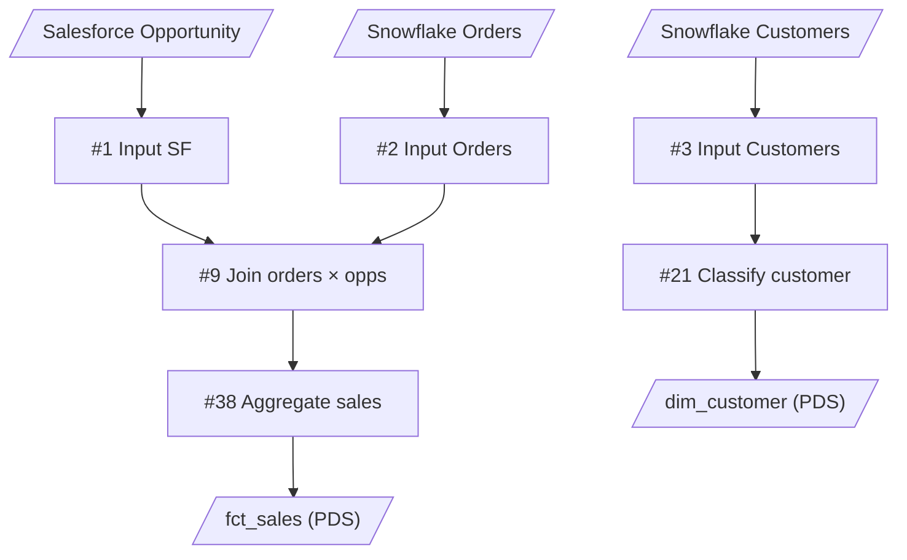
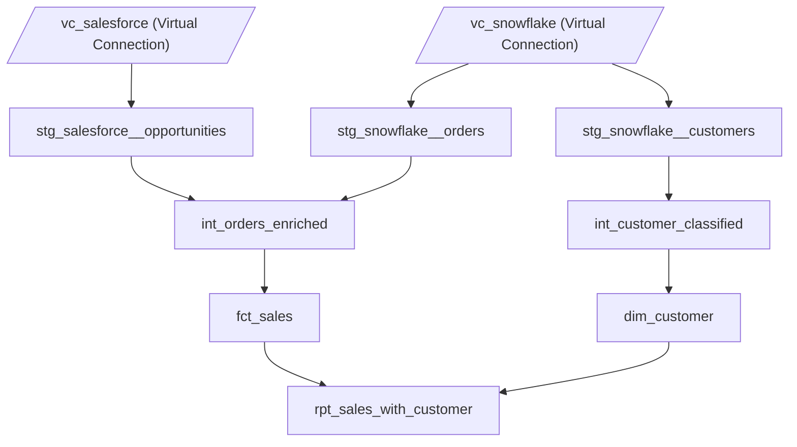

# decomposition-plan-format

**decompose フェーズ**の出力——分解設計案の書式と必須セクションを定義する。**`prep-builder`**（build フェーズ）および **`prep-deployer`**（publish フェーズ）が機械的に解釈できる構造を保証する。

## トップレベル構造

必須セクション（順序固定）：

```markdown
# Decomposition Plan: <flow-name>

## Summary
## New .tfl files
## Actions-level splits
## Output mapping (original → decomposed)
## Target Tableau Cloud project layout
## Dependency DAG (Mermaid)
## Migration order
## Alternatives considered
```

各セクションが参照する判断基準:

- `Actions-level splits` — [../.claude/skills/prep-architect/references/intermediate-decomposition.md](../.claude/skills/prep-architect/references/intermediate-decomposition.md)（1 SuperTransform を複数 .tfl に分けるケース）
- `Target Tableau Cloud project layout` — [project-hierarchy.md](project-hierarchy.md)
- Input 整理 — [input-policy.md](input-policy.md)

## 各セクションの書式

### Summary

```markdown
## Summary

- 元フロー: source.tflx（47 ステップ）
- 新規 .tfl: 8 個
  - stg: 3 個（salesforce__opportunities, snowflake__orders, snowflake__customers）
  - int: 2 個（entity 別: orders, customer — 各 1 .tfl にまとめる）
  - marts: 3 個（fct 1 + dim 1 + rpt 1）
- publish 粒度: **全層 (stg/int/marts) を Published DS として publish**。下流レイヤは上流レイヤの PDS を Input として参照 (Cloud では flow 間 chain は PDS 経由が前提、Hyper file 出力は cross-flow 共有不可)
```

### New .tfl files

各新 .tfl ごとに 1 セクション。レイヤ順（stg → int → mart）に並べる：

```markdown
## New .tfl files

### stg_salesforce__opportunities

- **Layer**: staging
- **Inputs**:
  - Source: `vc_salesforce` (仮想接続) / `Opportunity` テーブル
- **Outputs**:
  - Type: Published Data Source
  - Name: `stg_salesforce__opportunities`
  - Target project: `Sales Analytics/stg` (publish 先は [project-hierarchy.md](project-hierarchy.md))
- **Included original steps**: 1, 2, 3
- **Upstream lineage** (REQUIRED — each step must be Prev-reachable from one of the Inputs above):
  | Included step | Reachable from Input | Source Prev chain |
  |---|---|---|
  | #1 LoadSql Opportunity | (self, Input) | — |
  | #2 SuperTransform Clean A | #1 | #1 → #2 |
  | #3 SuperTransform Clean B | #1 | #1 → #2 → #3 |
- **Description**:
  Salesforce の Opportunity テーブルから列リネームと型キャストのみを行う。

### stg_snowflake__orders

[同じ書式で続く]

### int_orders_enriched

- **Layer**: intermediate
- **Inputs**:
  - Published DS: `stg_snowflake__orders`
  - Published DS: `stg_salesforce__opportunities`
- **Outputs**:
  - Type: Published Data Source
  - Name: `int_orders_enriched`
  - Target project: `Sales Analytics/intermediate`
- **Joins**:
  - #9 SuperJoin orders × opps: cardinality `N:1` (各 order に対し対応する opp は 1 件)
- **Included original steps**: 9, 10, 11, 12, 13, 14, 15, 16, 17, 18, 19, 20
- **Upstream lineage** (REQUIRED):
  | Included step | Reachable from Input(s) | Source Prev chain |
  |---|---|---|
  | #9 SuperJoin orders×opps | `stg_snowflake__orders`, `stg_salesforce__opportunities` | (#5 + #6) → #9 |
  | #10 SuperTransform Filter | `stg_snowflake__orders`, `stg_salesforce__opportunities` | #9 → #10 |
  | ... | ... | ... |
- **Description**:
  orders entity に関する intermediate 処理を 1 .tfl にまとめる（[intermediate-decomposition.md](intermediate-decomposition.md) の原則）: フィルタ（status='active', テストデータ除外）→ Salesforce Opportunity との JOIN → 売上区分・優良顧客フラグ等のビジネスロジック計算。

### int_customer_classified

- **Layer**: intermediate
- **Inputs**:
  - Published DS: `stg_snowflake__customers`
- **Outputs**:
  - Type: Published Data Source
  - Name: `int_customer_classified`
  - Target project: `Sales Analytics/intermediate`
- **Included original steps**: 21, 22, 23, 24
- **Description**:
  customer entity の分類ロジック（LTV ランク・セグメント判定）。dim_customer の素材となる。

### fct_sales

- **Layer**: marts
- **Inputs**:
  - Published DS: `int_orders_enriched`
- **Outputs**:
  - Type: Published Data Source
  - Name: `fct_sales`
  - Target project: `Sales Analytics/marts`
- **Included original steps**: 38, 39, 40, 41, 42
- **Description**:
  最終的な売上ファクト。dim_customer とは別 Published DS として publish（再利用素材）。BI が顧客属性込みで読む用途には別途 `rpt_sales_with_customer.tfl` を作って結合済み Published DS を提供する。

### dim_customer

[同じ書式で続く。Inputs: Published DS `int_customer_classified` / Outputs: Published DS `dim_customer` / Target project: `Sales Analytics/marts`]

### rpt_sales_with_customer

- **Layer**: marts
- **Inputs**:
  - Published DS: `fct_sales`
  - Published DS: `dim_customer`
- **Outputs**:
  - Type: Published Data Source
  - Name: `rpt_sales_with_customer`
  - Target project: `Sales Analytics/marts`
- **Joins**:
  - LEFT JOIN fct_sales × dim_customer on customer_id: cardinality `N:1` (各 sale に対し対応する customer は 1 件)
- **Description**:
  fct_sales × dim_customer を customer_id で LEFT JOIN した OBT。Workbook では Published DS 同士の Relationship が使えないため、BI が顧客属性込みで売上分析を行う用途にはこれを読ませる。
```

### Joins field の書式

`**Joins**` フィールドは **SuperJoin ノード、または .tfl 内で Join を行うステップを含む .tfl のみ** で必須 (Hyper Input 同士の Join、Published DS 同士の Join どちらも対象)。SuperUnion は row 連結のため cardinality 概念が適用外で、本フィールドの対象外。

書式:

- 1 行 1 Join。`#<step-index> <ノード名>: cardinality \`<N:M>\` (補足)` または `<JOIN-type> <left> × <right> on <key>: cardinality \`<N:M>\` (補足)`
- cardinality は `1:1` / `1:N` / `N:1` / `N:N` / `不明` のいずれか
- **不明な場合も明示的に `不明` と書く** (空欄不可、書き忘れ防止)
- カッコ書きで自然言語の補足を入れて良い (例: `1:N (1 opportunity → 複数 orders)`)
- 該当 Join が無い .tfl では本フィールドを省略する

### Lineage closure invariant (なぜ Upstream lineage が必須か)

`Included original steps` に書いた各ステップは、**元 flow の Prev 連鎖を辿ったときに、その新 .tfl が宣言した Inputs のいずれかに到達する必要がある**。

**下流の結合キー (`[ID]` 等) から逆推定して配置先 .tfl を決めると、その列が上流 Input に存在しないケースで run 時に `Unknown field name` で失敗する**。配置先は必ず上流から判定する。

判定の正しい順序:

1. flow-summary.md の Topology 表で **そのステップの Prev** を確認
2. Prev を辿って **元の Input ノードを特定**
3. その Input が新 .tfl の Inputs に含まれているか確認
4. 含まれていなければ **そのステップは別の .tfl に配置** すべき

`Upstream lineage` 表を埋める作業がこの 3 ステップを強制する。書かなくて済むと逆推定で済まされて事故る。

prep-builder の build 開始前に [`scripts/flow_io.py`](../scripts/flow_io.py) の `verify_lineage_closure` が同じ不変条件を機械的にチェックする (二重防御)。

### Actions-level splits

1 つの SuperTransform ノードが **複数レイヤに跨る actions** を持つ場合、その actions を分割して別々の .tfl に振り分ける必要がある。例: 「Clean 1」が `Rename×4`（stg 相当の単純整形）と `ROW_NUMBER LOD`（int 相当の Window 計算）を 1 ノードに同梱しているケース。判断基準は [intermediate-decomposition.md](../.claude/skills/prep-architect/references/intermediate-decomposition.md) 参照。

判定の元データは [analysis-report-format.md](../.claude/skills/prep-architect/references/analysis-report-format.md) — actions inventory（prep-extractor の `inspect_actions.py` 出力 / `flow-summary.md` の SuperTransform actions inventory セクション）を参照。

```markdown
## Actions-level splits

| 元ノード | 元 actions 内訳 | 分割案 | 備考 |
|---|---|---|---|
| Clean 1 (#4) | Rename×4 (USD 表記統一) + AddCol×1 (ROW_NUMBER LOD) | stg__transactions.tfl: Rename×4 のみ／int 側で改めて ROW_NUMBER を生成 | 単純整形と Window 計算の混在 |
| Clean 2 (#5) | ChangeType + FIXED MAX + Filter + Rename×2 | stg: ChangeType のみ／int: FIXED MAX + Filter + Rename×2 | 型キャストと業務集約の混在 |
| Clean 15 (#23) | RemoveCol×2 + PATH 最終調整 (PARTITION ROW_NUMBER) | int: PATH 再採番／mart 側で必要なら RemoveCol 追加 | Window と最終整形の混在 |

### 分割の原則

- **依存関係を保つ**: 後段 actions が前段 actions の出力列を参照する場合、順序を勝手に並び替えない (実装は prep-builder に委ねる)
- **新規 .tfl の数は最小化**: 「actions を 1 つずつ別 .tfl」のような過剰分割はしない。レイヤ境界で切るのが原則
- **意味のかたまりを優先**: 業務ロジック的に 1 つの「列追加群」（例: Clean 6 の AddCol×9 = 損益計算）は 1 .tfl 内に保つ
- **削除候補ノードも明示**: actions=0 の空ノード（例: Clean 13）は分割対象ではなく削除対象
```

### Output mapping (original → decomposed)

機械可読の名前対応表。元フローの output PDS と、それを引き継ぐ分解後 flow の output PDS を 1 行 1 ペアで列挙する。**元フローの output と対応関係のある分解後 flow のみ** 行を持つ (通常は marts レイヤ、ただし元フローが intermediate 相当の PDS を直接出力していた場合はその対応も記載)。**元フローに対応 output が無い分解後 flow (新規生成された stg/int の中間 PDS 等)** は本表に出さず、publish-manifest 上で `source_original_output_name = null` として登録される。1 元 PDS → 複数 marts への fan-out があれば複数行で表現する。

```markdown
## Output mapping (original → decomposed)

| Original output PDS | Decomposed flow | Decomposed output PDS |
|---|---|---|
| stockmarket_transaction_prepped | fct_transactions_summary | fct_transactions_summary |
| stockmarket_transaction_detailed_prepped | fct_transactions_matched | fct_transactions_matched |
```

列の意味:

- `Original output PDS`: 元フローの PublishExtract Output ノードが書き出している PDS 名 (flow-summary.md `Meta` の `Outputs:` リストと一致)
- `Decomposed flow`: 分解後 .tfl の名前 (拡張子なし)。`## New .tfl files` 配下のセクション名と一致
- `Decomposed output PDS`: その flow が publish する PDS 名。本リポ規約では flow 名と同名

**用途**: [prep-builder](../.claude/skills/prep-builder/SKILL.md) が build 完了時に [scripts/publish_manifest.py init](../scripts/publish_manifest.py) でパースして `decomposed_flows[].source_original_output_name` に転記する。最終的に [prep-output-comparator](../.claude/skills/prep-output-comparator/SKILL.md) のペア解決で参照される (本表が欠けると `auto-detect 禁止` の方針で comparator がペアを組めない)。

書式契約は [publish-manifest-format.md](publish-manifest-format.md) と一体。

### Target Tableau Cloud project layout

実装側の階層仕様は [project-hierarchy.md](project-hierarchy.md) 参照。

```markdown
## Target Tableau Cloud project layout

Parent project: `Sales Analytics`（ユーザー指定、要事前作成）

| Subproject | Contains (.tfl) | Published DS | Permissions (推奨) |
|---|---|---|---|
| `stg` | stg_salesforce__opportunities, stg_snowflake__orders | stg_salesforce__opportunities, stg_snowflake__orders | ETL team: Editor / Others: Viewer |
| `intermediate` | int_orders_enriched, int_customer_classified | int_orders_enriched, int_customer_classified | ETL team: Editor / Others: None |
| `marts` | fct_sales, dim_customer, rpt_sales_with_customer | fct_sales, dim_customer, rpt_sales_with_customer | BI team: Editor / Wide: Viewer |

Project creation commands（`prep-deployer` で実行）:
```bash
python create_projects.py --parent-name "Sales Analytics"
```
```

### Dependency DAG (Mermaid)

**Before (元フロー)** と **After (分解後)** の 2 ブロック構成。ユーザーは両図を見比べて「どのノードがどの .tfl に振り分けられたか」「stg/int/marts の振り分けが妥当か」を視覚的に確認・合意する。decompose 完了後 build 前のユーザー確認 ([../.claude/skills/prep-architect/SKILL.md](../.claude/skills/prep-architect/SKILL.md) の「analyze と decompose の間で一度必ずユーザーに確認を取る」) で本 DAG を提示する。

```markdown
## Dependency DAG (Mermaid)

### Before (元フロー)



### After (分解後)


```

**書式ルール**:

- **Before は元フロー全ノードを描かなくて良い**。主要な分岐点 (Input / Join / Output / レイヤ判定の根拠になる中間ノード) のみ抽出する。50+ ノードを全描画すると視認性が落ちる
- **After は分解後 .tfl すべてを描く**。粒度が荒くなり全描画可能
- ノード形状の使い分け:
  - Source / Output PDS: `[/"..."/]` (sliced shape)
  - 元フローのノード (Before): `[#<index> <node-name>]` (rect、`#` で原 flow-summary の Topology 表 index と対応付け)
  - 分解後 .tfl (After): `[<tfl-name>]` (rect)
- ノード ID (左側の `n1`, `stg_sf` 等) は短く、表示名は冗長でも可

### Migration order

```markdown
## Migration order

段階的に移行することで、既存フローと並走させながら安全に切り替える（Step 番号は本セクション内ローカル、Skill 間 workflow とは別軸）：

1. **Step 1 (stg)**: stg_*.tfl を build して Hyper 出力を確認。既存フローとは無関係に並走
2. **Step 2 (int)**: int_*.tfl を build、stg の Hyper を入力に動作確認
3. **Step 3 (marts fct/dim)**: fct_sales / dim_customer を build、Published DS に publish
4. **Step 4 (marts rpt)**: rpt_sales_with_customer.tfl を build、fct_sales / dim_customer の Published DS を Input にして JOIN 済み Published DS を publish（Linked Tasks で Step 3 → Step 4 の連鎖）
5. **Step 5 (検証)**: 既存フローの出力と数値一致を確認
6. **Step 6 (切替)**: BI 側の参照先を新 Published DS（rpt または fct/dim 直接）に切り替え
7. **Step 7 (廃止)**: 旧 source.tflx をアーカイブ
```

### Alternatives considered

```markdown
## Alternatives considered

### 案 B: int_orders を step 連鎖分割する（採用しなかった）

`int_orders_enriched.tfl` を `int_orders_step1_filter` / `int_orders_step2_join_sf` / `int_orders_step3_categorize` の 3 つに連鎖分割する案。

- 利点: 各 .tfl のノード数を 10 個前後に抑え、ステップごとの責務が明示的になる
- 欠点: [intermediate-decomposition.md](intermediate-decomposition.md) の **例外条件を満たさない**（1 .tfl が 30+ ノードでない、中間結果を別 entity から参照しない、別チームメンテも該当しない）。同 entity を 3 ファイル間で行き来する保守コスト・publish 順序の管理コストが上回る

→ A 案（1 entity 1 .tfl の原則どおり `int_orders_enriched.tfl` に集約）を採用。

### 案 C: dim_customer を作らず fct_sales に customer 情報を埋め込む（採用しなかった）

- 利点: Published DS 1 つで完結、BI から見て単純
- 欠点: dim_customer を別 fct（例: fct_returns）から再利用できない、customer マスター変更時に fct_sales 全体を再生成、マテリアライズコスト増

→ A 案（fct/dim 分離 + rpt で物理 JOIN 済み版を提供）を採用。
```

## ファイル名と出力先

`<output_dir>/decomposition-plan-<flow-name>.md` に必ずファイル出力する (短いプランでも inline 返しはしない)。会話への戻り値は実行サマリのみ (prep-architect [SKILL.md §出力契約](../.claude/skills/prep-architect/SKILL.md#出力契約))。

## prep-builder / prep-deployer への引き継ぎ

| セクション | 利用するフェーズ |
|---|---|
| `New .tfl files` | prep-builder が .tfl を生成するために必須 |
| `Actions-level splits` | prep-builder が 1 SuperTransform を複数 .tfl に分けるときの指示書（`beforeActionAnnotations` の振り分け） |
| `Output mapping (original → decomposed)` | prep-builder が build 完了時に `publish_manifest.py init` で読み取り、prep-output-comparator のペア解決に最終的に使う ([publish-manifest-format.md](publish-manifest-format.md)) |
| `Target Tableau Cloud project layout` | `prep-deployer` が `create_projects.py` を呼ぶときに参照 |
| `Dependency DAG` | publish 順序の決定 |
| `Migration order` | ユーザー向けの段階移行ガイド |

書式が乱れると後続フェーズが誤読する。**必ず本テンプレに従う**。
